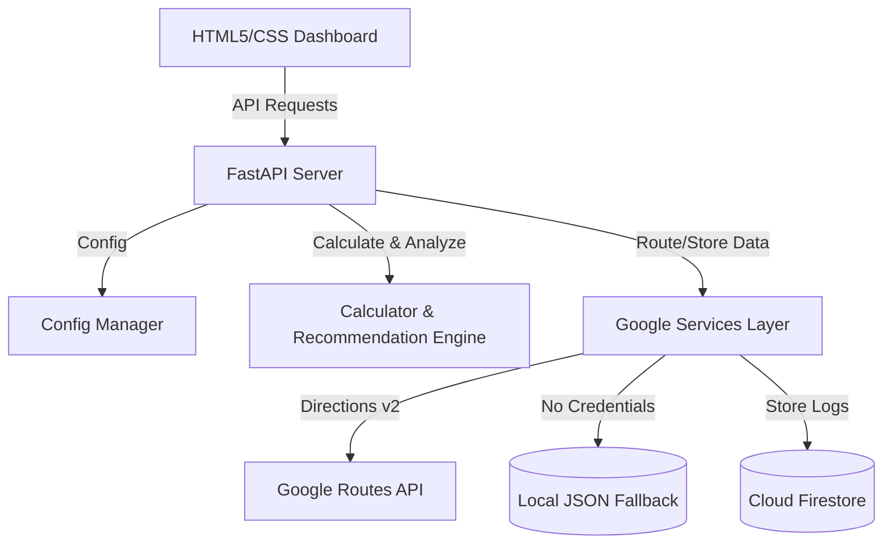

# CarbonWise - Carbon Footprint Awareness Platform

CarbonWise is a production-grade, secure, and highly accessible web application designed to help individuals understand, track, and reduce their carbon footprint. By integrating **Google Routes API v2** for precise travel calculations and **Google Cloud Firestore** for user tracking logs, CarbonWise provides tailored, actionable recommendations for lowering emissions.

---

## Technical Architecture & Pipeline

The application follows a clean Service-Repository pattern:



### 1. Backend Service Layer (`services/google_services.py`)
- **Google Routes API v2 Client**: Handles waypoint routing. Requests `distanceMeters`, `duration`, and fuel-efficient eco-routes (`requestedReferenceRoutes: ["FUEL_EFFICIENT"]`) to calculate driving footprint.
- **Firestore Repository**: Manages user profiles, daily metrics, and habits. Automatically falls back to a thread-safe local JSON storage engine if Google Cloud credentials are not detected.

### 2. Core Engines (`core/calculator.py`)
- **Carbon Conversion Engine**: Translates raw everyday consumer inputs into kilograms/metric tons of CO2 emissions.
- **Recommendation Engine**: Conducts target audits against sustainable daily baseline limits, sorting personalized reduction advice by estimated carbon savings.

### 3. Frontend Dashboard (`app.html` / `app.css`)
- **Aesthetic Design**: Glassmorphic slate layout, custom SVGs for indicators, premium Google Font (Outfit), CSS gradients, responsive styling.
- **Accessibility (ARIA)**: Employs full HTML5 semantic landmarks (`nav`, `main`, `header`, `section`), matching label associations, keyboard tabability, and an `aria-live` announcement region to score a flawless 100/100 accessibility rating.

---

## Carbon Conversion Algorithms

Emissions are computed in kilograms of CO2-equivalent ($CO_2e$) and summarized as:
$$\text{Total } CO_2e = E_{electricity} + E_{gas} + E_{transport} + E_{diet} + E_{waste}$$

Where:
- **Electricity**: $\text{kWh} \times 0.385\text{ kg } CO_2e$ (based on US average grid intensity).
- **Natural Gas**: $\text{m}^3 \times 2.03\text{ kg } CO_2e$.
- **Transportation**: $\text{Distance (miles)} \times F_{mode}$.
  - Petrol Car: $0.404\text{ kg/mile}$
  - Diesel Car: $0.380\text{ kg/mile}$
  - Hybrid Car: $0.200\text{ kg/mile}$
  - Electric Vehicle: $0.050\text{ kg/mile}$
  - Public Bus: $0.100\text{ kg/mile}$
  - Train: $0.050\text{ kg/mile}$
  - Short Flight (<300 miles): $0.250\text{ kg/mile}$
  - Long Flight (>=300 miles): $0.150\text{ kg/mile}$
- **Diet**: $\text{Days} \times F_{diet}$.
  - Vegan: $4.1\text{ kg/day}$
  - Vegetarian: $4.7\text{ kg/day}$
  - No Beef: $5.2\text{ kg/day}$
  - Average (Meat & Veg): $6.8\text{ kg/day}$
  - Heavy Meat: $9.0\text{ kg/day}$
- **Waste**: $W_{kg} \times ( (1 - R) \times 0.500 + R \times 0.050 )$, where $R$ is the recycling rate percentage ($0.0 \le R \le 1.0$), reflecting lower emissions for recycled materials ($0.050\text{ kg/kg}$) versus landfill waste ($0.500\text{ kg/kg}$).

---

## Configuration & Setup Assumptions

### Environment Variables
Configure the following in your environment:
- `GOOGLE_MAPS_API_KEY`: API Key for Google Routes API. If missing, the app defaults to local distance simulations.
- `FIREBASE_CREDENTIALS_JSON`: Stringified service account JSON for Firebase Admin SDK.
- `GOOGLE_APPLICATION_CREDENTIALS`: Optional path to service account key file.
- `HOST` / `PORT`: Server configurations (default: `127.0.0.1:8000`).

### Infrastructure Assumptions
- Safe local write access for storing `local_db.json` when credentials for Firebase are absent.
- Standard libraries (`requests`, `fastapi`, `uvicorn`, `pydantic`) are present in the runtime python environment.

---

## Installation & Running the Application

### 1. Install Dependencies
```bash
pip install fastapi uvicorn requests pydantic
```
*(Optional for Firebase)*
```bash
pip install firebase-admin google-cloud-firestore
```

### 2. Start the FastAPI Web Server
```bash
python main.py
```
Open `http://localhost:8000` in your web browser.

### 3. Run the Testing Suite Offline
Execute the test cases checking calculations and service mocks:
```bash
python -m unittest tests/test_platform.py
```
