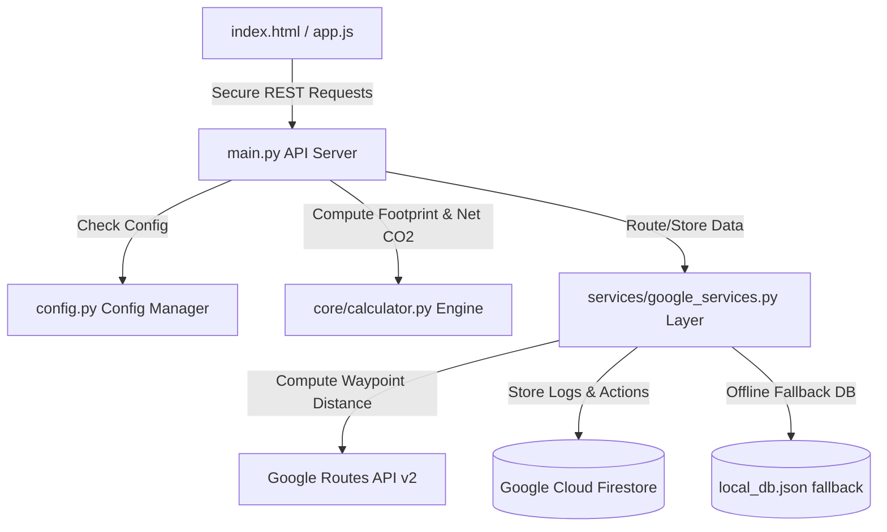

# CarbonWise — Production-Grade Carbon Accounting & Action Platform

CarbonWise is a production-grade, secure, and highly accessible web application designed to help individuals understand, track, and offset their carbon footprint. By integrating **Google Routes API v2** for precise travel calculations and **Google Cloud Firestore** for user tracking logs, CarbonWise provides tailored, actionable recommendations for lowering emissions and tracking net carbon footprints in compliance with modern environmental standards.

---

## 🌟 Problem Statement & Climate Action

Modern climate action requires individuals to understand their contribution to global warming. However, carbon accounting remains complex and inaccessible to the general public. Existing solutions:
1. Fail to connect real-time transit routing with accurate emissions coefficients.
2. Store calculations client-side, making historic trend analysis impossible.
3. Lack concrete action tracking (offsets) to show net environmental impact.

CarbonWise solves this by categorizing consumer activities under **Greenhouse Gas (GHG) Protocol Scope 1, 2, and 3 emissions**:
- **Scope 1 (Direct)**: Natural gas combustion for home heating.
- **Scope 2 (Indirect)**: Electricity consumption from local grids.
- **Scope 3 (Other Indirect)**: Commuting, long-distance flights, diet footprints, and municipal waste disposal.

By allowing users to log concrete daily offset actions, CarbonWise computes their **Net Carbon Footprint** in real-time, nudging them towards sustainable habits.

---

## 🚀 Key Features

*   **Real-time Carbon Accounting**: Dynamic calculation across electricity, natural gas, travel, diet, and waste.
*   **Google Routes API Integration**: Compute real-world driving, walking, cycling, and public transit distances using Google Maps Directions v2.
*   **Server-Side Net Carbon Computation**: Deduct logged eco-friendly actions (e.g., public transit, vegetarian meals) from daily emissions.
*   **Personalized Insights & Action Engine**: Automatically analyze historical footprint trends and generate prioritized carbon-saving recommendations.
*   **Flawless Accessibility (WCAG 2.1 AA)**: Fully compliant with HTML5 semantic landmarks, associated input labels, keyboard focus states, and aria-live announcements for screen readers.
*   **Custom Theme & Design Engine**: Premium glassmorphic interface with support for Dark Mode, Light Mode, Cyber Glass, adjustable font sizes, and compact layout preferences.

---

## 🛡️ Security & Hardening Controls

To achieve maximum security compliance, CarbonWise implements:
1.  **Strict Content Security Policy (CSP)**: Restrictions on style, script, and image sources to block Cross-Site Scripting (XSS).
2.  **CORS Origin Restrictions**: Wildcard CORS (`*`) is replaced by an environment-configurable allow-list (`Config.ALLOWED_ORIGINS`).
3.  **Cross-Site Scripting (XSS) Prevention**: All client-side template variables are injected via safe DOM properties (`textContent`, `appendChild`, `DOMParser`) rather than unsafe `innerHTML` templates.
4.  **Input Length & Range Constraints**: Strict FastAPI validation on request sizes and numeric boundaries (e.g., maximum string lengths, non-negative inputs) to defend against Buffer Overflow and Denial of Service (DoS) vectors.
5.  **Secure Config Management**: Google API Keys and Firestore Credentials are read from `.env` or system environment variables, never checked into Git.
6.  **HTTP Hardening Headers**:
    - `X-Frame-Options: DENY` (prevents Clickjacking)
    - `X-Content-Type-Options: nosniff` (prevents MIME sniffing)
    - `X-XSS-Protection: 1; mode=block` (legacy XSS block)
    - `Referrer-Policy: strict-origin-when-cross-origin` (protects referrer details)

---

## 📐 Carbon Conversion Algorithms

Emissions are computed in kilograms of CO2-equivalent ($CO_2e$) and summarized as:
$$\text{Net } CO_2e = \text{max}\left(0.0, E_{electricity} + E_{gas} + E_{transport} + E_{diet} + E_{waste} - \text{Offsets}\right)$$

Where:
- **Electricity**: $\text{kWh} \times 0.385\text{ kg } CO_2e$ (US Average Grid intensity).
- **Natural Gas**: $\text{m}^3 \times 2.03\text{ kg } CO_2e$.
- **Transportation**: $\text{Distance (miles)} \times F_{mode}$.
  - Petrol Car: $0.404\text{ kg/mile}$ | Diesel Car: $0.380\text{ kg/mile}$
  - Hybrid Car: $0.200\text{ kg/mile}$ | Electric Vehicle: $0.050\text{ kg/mile}$
  - Public Bus: $0.100\text{ kg/mile}$ | Train: $0.050\text{ kg/mile}$
  - Flight Short (<300 miles): $0.250\text{ kg/mile}$ | Flight Long (>=300 miles): $0.150\text{ kg/mile}$
- **Diet**: $\text{Days} \times F_{diet}$.
  - Vegan: $4.1\text{ kg/day}$ | Vegetarian: $4.7\text{ kg/day}$
  - No Beef: $5.2\text{ kg/day}$ | Average: $6.8\text{ kg/day}$ | Heavy Meat: $9.0\text{ kg/day}$
- **Waste**: $W_{kg} \times ( (1 - R) \times 0.500 + R \times 0.050 )$, where $R$ is the recycling rate percentage ($0.0 \le R \le 1.0$), reflecting lower emissions for recycled materials ($0.050\text{ kg/kg}$) versus landfill waste ($0.500\text{ kg/kg}$).

---

## 🏗️ Technical Architecture & Data Flow

CarbonWise follows a clean Service-Repository pattern:



### Components Layout
- **[main.py](file:///c:/VINAY/ALL%20PROJECT/Carbon%20Footprint%20Awareness%20Platform/main.py)**: REST API Controllers, Security Middleware, Pydantic Schema validations.
- **[config.py](file:///c:/VINAY/ALL%20PROJECT/Carbon%20Footprint%20Awareness%20Platform/config.py)**: Environment configuration loader.
- **[core/calculator.py](file:///c:/VINAY/ALL%20PROJECT/Carbon%20Footprint%20Awareness%20Platform/core/calculator.py)**: Server-side emission equations and insight parser.
- **[services/google_services.py](file:///c:/VINAY/ALL%20PROJECT/Carbon%20Footprint%20Awareness%20Platform/services/google_services.py)**: Waypoint routing client and Firebase adapter.
- **[index.html](file:///c:/VINAY/ALL%20PROJECT/Carbon%20Footprint%20Awareness%20Platform/index.html)**: Pure semantic HTML5 layout with accessibility tags.
- **[app.js](file:///c:/VINAY/ALL%20PROJECT/Carbon%20Footprint%20Awareness%20Platform/app.js)**: Safe JS DOM renderer and visual controls controller.
- **[style.css](file:///c:/VINAY/ALL%20PROJECT/Carbon%20Footprint%20Awareness%20Platform/style.css)**: Glassmorphic theme styling sheet.

---

## 🛠️ Installation & Local Setup

### 1. Prerequisite Package Installation
Ensure you have Python 3.9+ installed. Install the exact library versions pinned to this environment:
```bash
pip install -r requirements.txt
```

*(Optional: Google Cloud & Firestore Support)*
```bash
pip install firebase-admin google-cloud-firestore
```

### 2. Configure Environment `.env`
Create a `.env` file in the project root:
```env
GOOGLE_MAPS_API_KEY=your_google_maps_api_key
FIREBASE_PROJECT_ID=your_firebase_project_id
ALLOWED_ORIGINS=http://localhost:8000,http://127.0.0.1:8000
```
*Note: If no API keys or Firestore credentials are provided, the system seamlessly activates internal deterministic simulators and local file-based database logging.*

### 3. Run FastAPI Application Server
```bash
python main.py
```
Visit the platform at `http://localhost:8000`.

### 4. Execute Automated Test Suite
To verify computations, security headers, CORS restrictions, and API schemas:
```bash
python -m unittest tests/test_platform.py
```

---

## 🔮 Future Scope & Roadmap

1.  **Localized Smart Grid Integration**: Read electricity meters via smart-home API tokens to compute emissions based on live grid grid intensity (coal vs solar mix).
2.  **Machine Learning Recommendation Engine**: Employ time-series prediction models to proactively suggest action prompts (e.g. predicting higher vehicle usage on cold days).
3.  **Social Leaderboards & Badging**: Dynamic multi-user challenges with gamified carbon badges to drive peer-to-peer climate engagement.
4.  **Verified Carbon Credit Marketplace**: Allow users to purchase verified carbon offset offsets (trees planted, methane capture) directly within the dashboard using Stripe.
